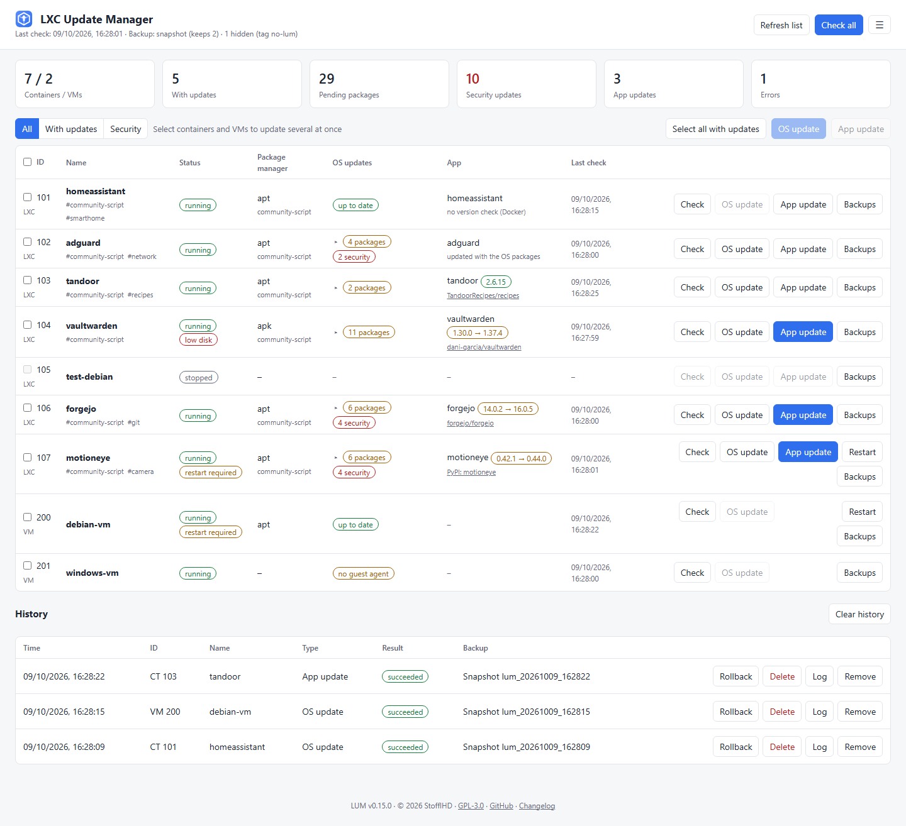
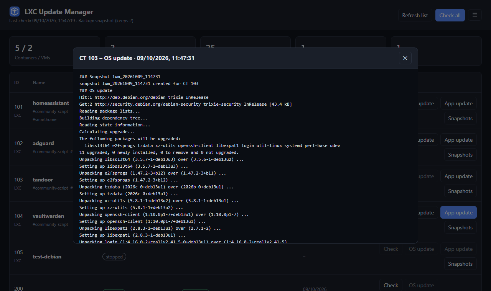
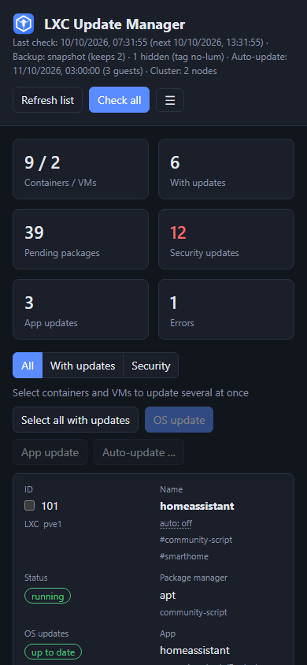

<p align="center"></p>

# LUM – LXC Update Manager

Manage OS updates (apt/apk) of all LXC containers **and VMs** on a Proxmox host – and the
app updates of containers created with the
[Proxmox VE Community Scripts](https://github.com/community-scripts/ProxmoxVE) – from one
web UI. One guest or many at once, with a snapshot or backup before every update,
rollback with one click and checks for free space and pending restarts.

<picture>
  <source media="(prefers-color-scheme: dark)" srcset="docs/images/dashboard-dark.png">
  
</picture>

## Features

- **Containers and VMs in one list** – LXC via `pct`, VMs via the QEMU guest agent, on a
  single host or all nodes of a cluster; tag a guest `no-lum` to keep LUM away from it,
  or `self-created` for OS updates only
- **OS updates** (apt / apk) with one click and a live log – or for several guests at
  once, one after the other; security updates are highlighted and can be filtered
- **Automatic updates** per guest in a maintenance window (days, start, end), optionally
  with restarts
- **Telegram notifications** about failed (or all) updates and available updates
- **Export / import** of settings, auto-update choices and history
- **Restart required** – shows when services still run replaced libraries or a VM has a
  newer kernel, with a restart button
- **Free space check** before every update, in the guest and on the vzdump storage, and
  an optional cleanup afterwards (`apt autoremove`, `apt clean`)
- **App updates** for community-script containers, with installed vs. latest version from
  GitHub, Codeberg, GitLab, PyPI or npm
- **Safety first** – snapshot or vzdump backup before every update, cleanup, rollback;
  restore or delete LUM's vzdump backups from the web UI
- **History** with stored logs, snapshots can be rolled back or deleted and vzdump backups
  deleted from there; clearing it can delete all of LUM's snapshots and backups too
- **Secure by design** – the host only allows a fixed set of commands, LUM touches only
  its own snapshots and backups; login with lockout and CSRF protection
- **Responsive** web UI with light and dark theme and a settings page, works behind a reverse proxy
- **Easy installer** for the Proxmox host and an `update` command inside the container

<p>
  
  &nbsp;
  
</p>

## Quick start

On the Proxmox host (shell as root):

```bash
bash <(curl -fsSL https://raw.githubusercontent.com/StofflHD/LUM-lxc-update-manager/main/install.sh)
```

Answer a few questions (Enter accepts the suggestion). The installer creates a small
Debian container, installs LUM and the host script, and prints the URL and the login.

Update later inside the LUM container:

```bash
update
```

For VMs, install `qemu-guest-agent` in the VM and enable *QEMU Guest Agent* in its Proxmox
options – see [VMs](docs/usage.md#vms).

## Documentation

| | |
|---|---|
| [Using LUM](docs/usage.md) | Web UI, bulk updates, security updates, app updates, free space, backups and rollback, cleanup, restart, VMs, login |
| [Installation and updates](docs/installation.md) | Installer options, unattended install, updating, uninstall |
| [Reverse proxy](docs/reverse-proxy.md) | HTTPS with Nginx Proxy Manager, nginx, Caddy or Traefik |
| [Configuration](docs/configuration.md) | All settings in `.env` |
| [Troubleshooting](docs/troubleshooting.md) | Common problems and fixes, logs |
| [API](docs/api.md) | HTTP API of the web UI |
| [Development](docs/development.md) | Demo mode without Proxmox |
| [Changelog](CHANGELOG.md) | What changed in which version |

## How it works

```
LXC "lxc-update-manager" (FastAPI + SQLite + web UI, port 8080)
        │  SSH, restricted key (forced command)
        ▼
Proxmox host: /usr/local/bin/lxc-update-wrapper
        │  pct exec / qm guest exec / snapshot / vzdump / pvesh
        │  (cluster: guests on other nodes → their lxc-update-wrapper, cluster SSH)
        ▼
LXC 101, 102 …   VM 200, 201 … (via QEMU guest agent)
```

LUM runs in its own container and reaches the Proxmox host over SSH with a key that may
only call the host script (`lxc-update-wrapper`). The script accepts a fixed set of verbs
(`version`, `list`, `nodes`, `info`, `check`, `upgrade`, `app-version`, `pkg-version`, `app-update`,
`restart-needed`, `restart`, `space`, `snapshot`, `snapshots`, `prune-snapshots`, `delete-snapshot`,
`rollback`, `backup`, `prune-backups`, `backups`, `delete-backup`, `restore-backup`),
validates every argument, refuses containers and VMs tagged `no-lum` and only ever touches snapshots named `lum_*` and backups with the note
`lxc-update-manager`. LUM never gets a shell on the host.

## Roadmap

- [x] App version detection and non-interactive app updates for community scripts
- [x] Version detection for Codeberg, GitLab, Git tags, PyPI and npm, pinned versions
- [x] VM support via the QEMU guest agent
- [x] Snapshot / vzdump before updates, cleanup, rollback
- [x] Login / authentication for the web UI
- [x] Restore and delete vzdump backups from the web UI
- [x] Update several guests in one go (select or "Select all with updates"), run as a queue
- [x] Highlight security updates (`*-security`) with their own badge and filter
- [x] "Restart required" after kernel / library updates, with a restart button
- [x] Check free disk space (guest and vzdump storage) before an update
- [x] Optional cleanup after an update (`apt autoremove` / `apt clean`)
- [x] Schedules / maintenance windows, auto-update per container
- [x] Notifications via a Telegram bot
- [x] Export / import of settings and history
- [x] Multiple nodes / cluster

Planned – not every item is decided yet:

- [ ] Health check after an update (guest running, app answers over HTTP), rollback offered if it fails
- [ ] Docker image updates inside containers (`docker compose pull` / `up`)
- [ ] Release notes of the new app version in the update dialog
- [ ] Hold back single packages per guest
- [ ] Notifications via ntfy / Gotify
- [ ] Multiple users with a read-only role, login via OIDC (e.g. Authentik)
- [ ] Prometheus metrics (pending updates per guest)

## License

Copyright (C) 2026 StofflHD

LUM is free software: you can redistribute it and/or modify it under the terms of the
[GNU General Public License version 3](LICENSE) as published by the Free Software
Foundation (GPL-3.0-only).

This program is distributed in the hope that it will be useful, but WITHOUT ANY WARRANTY;
without even the implied warranty of MERCHANTABILITY or FITNESS FOR A PARTICULAR PURPOSE.
See the GNU General Public License for more details.
