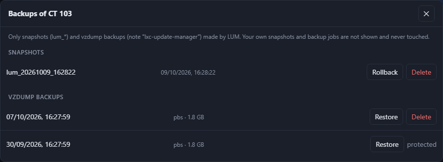

# Using LUM

[← Back to the README](../README.md)

## Using the web UI

| Where | Control | What it does |
|---|---|---|
| Top right | **Refresh list** | Re-reads only the list of containers/VMs (fast). New running guests are checked right away; the result is shown below the status line. |
| | **Check all** | Re-reads the list and checks every running guest for OS and app updates. Also runs automatically every `LUM_CHECK_INTERVAL_MINUTES`. |
| | **☰** menu | **Theme** (System / Light / Dark, stored in the browser), **Settings** (see [Configuration](configuration.md#in-the-web-ui)) and **Change password**. |
| Status line | | Last check, backup mode, guests hidden by the `no-lum` tag (hover for their IDs), result of **Refresh list**, and a yellow note when the host script is outdated. |
| Each row | `ID` · `LXC`/`VM` | Container or VM. VMs need the QEMU guest agent, otherwise **no guest agent** is shown. |
| | `▸ N packages` | Pending OS updates – click to list them. |
| | App column | Installed app version (green) or `installed → latest` (orange) with a link to the release page, PyPI or npm. **held back**: the community script pins this version; **pre-release**: the installed version is newer than the latest stable one. Without a version source: *updated with the OS packages*, *no version check (Docker)* or *Version unknown* – see [App updates](#app-updates). |
| | **Check** | Checks this one guest. |
| | **OS update** | Opens the update dialog (with the backup checkbox), then runs apt/apk with a live log. |
| | **App update** | Community-script app update (containers only; not shown for VMs). Highlighted when a newer app version exists. |
| | **Backups** | The guest's LUM snapshots (**Rollback**, **Delete**) and vzdump backups (**Restore**, **Delete**) – see [Backup, cleanup and rollback](#backup-cleanup-and-rollback). |
| History | `ID` · Name | Guest of the entry; the name stays visible after the guest was removed. |
| | **Rollback** · **Delete** | Roll back to / delete the snapshot made before that update. With vzdump: **Delete** removes the backup made before that update (not protected ones). |
| | **Log** · **Remove** | Show the stored log / remove the entry (the snapshot or backup is kept). |
| | **Clear history** | Removes all finished entries (running updates stay; snapshots and backups are kept). |

Below 1100 px window width every row turns into a card. The footer shows the version.
If the host script on the Proxmox host is older than this LUM version needs, a yellow
note below the status line says so and shows the command to update it.

## Excluding containers and VMs

Give a container or VM the Proxmox tag **`no-lum`** and LUM leaves it alone: it is not
listed, not checked and not updated. The host script refuses every command for such a
guest as well, so not even a misbehaving LUM could touch it. The status line shows how
many guests are hidden (hover for their IDs). The tag is case-insensitive.

Add the tag in the Proxmox UI (guest → *Summary* → pencil next to the tags) or on the
host:

```bash
pct set <CTID> --tags "no-lum"   # container
qm set <VMID> --tags "no-lum"    # VM
```

`--tags` replaces all tags of the guest. To keep existing ones, list them too, separated
by `;` (e.g. `--tags "mytag;no-lum"`).

The change shows up with the next **Refresh list** or **Check all**. Remove the tag to let
LUM manage the guest again.

## App updates

Containers created with the community scripts have an `update` command. LUM runs it in
the official silent mode (`PHS_SILENT=1`, the same call the community scripts'
`tools/pve/update-apps.sh` makes) and compares the installed with the latest app version.

### Where the version comes from

LUM reads the app's `ct/<app>.sh` from the community scripts and uses the same source the
script itself checks:

| The script uses | Latest version from | Installed version from |
|---|---|---|
| `check_for_gh_release` | highest stable GitHub release | `~/.<app>` in the container |
| `check_for_codeberg_release` | highest stable Codeberg release | `~/.<app>` |
| `check_for_gl_release` | highest stable GitLab release (also self-hosted GitLab) | `~/.<app>` |
| `check_for_gh_tag` | newest GitHub tag | `~/.<app>` |
| no check, but deploys the app's release (`fetch_and_deploy_*_release`) | as above | `~/.<app>` |
| no check, `pip install … --upgrade` | PyPI | `pip show` in the container |
| no check, `npm … -g` | npm registry | `npm ls -g` in the container |

Like the community scripts LUM takes the *highest* stable release (no drafts or
pre-releases, only tags with the script's prefix, if any). When a script **pins** a
version on purpose (e.g. Immich: "each release is tested individually"), LUM shows that
version as the latest and marks the app **held back** – the tooltip shows the reason.
An installed pre-release that is newer than the latest stable release (e.g. `0.45.0a1`
vs. `0.44.0`) is not an update – LUM shows it green with a **pre-release** hint.

Apps without a usable source show a hint instead of a version, and can still be updated:

- **updated with the OS packages** – the app comes from apt/apk (e.g. AdGuard, Zammad);
  its updates show up as OS updates.
- **no version check (Docker)** – e.g. Home Assistant.
- **Version unknown** – e.g. apps downloaded directly from the vendor.

The GitHub API allows 60 requests per hour without a token; LUM caches each version for an
hour. With many containers set `LUM_GITHUB_TOKEN` (menu ☰ → **Settings**).

In silent mode the community script deliberately stops in these cases:

| Exit | Meaning | Fix |
|---|---|---|
| 75 | The update needs interactive mode | Run `update` manually inside the container |
| 113 | The container has less CPU/RAM than the script requires | Increase resources (e.g. Tandoor: 4 CPU / 4 GB) |
| 114 | `/boot` is more than 80 % full | Free up space |


## VMs

OS updates, checks, snapshots, vzdump backups and rollback work for VMs too. Proxmox can
only run commands inside a VM through the **QEMU guest agent**, so each VM needs:

1. the agent installed and running in the VM, e.g. Debian/Ubuntu:
   `apt install qemu-guest-agent && systemctl enable --now qemu-guest-agent`
2. **QEMU Guest Agent** enabled in Proxmox (VM → Options), then a full VM shutdown and start
   (a reboot from inside the VM is not enough).

Without it the VM shows **no guest agent** (the tooltip explains what's missing).
Supported are Linux VMs with apt or apk. The agent returns the output only when a command
has finished, so the log of a VM update appears at the end. App updates are LXC only.

## Backup, cleanup and rollback

| `LUM_BACKUP_MODE` | What happens before the update | Cleanup |
|---|---|---|
| `snapshot` (default) | snapshot named `lum_<date>_<time>` (`pct`/`qm snapshot`) | keeps `LUM_SNAPSHOT_KEEP` (default 2) per guest |
| `vzdump` | Backup to `LUM_BACKUP_STORAGE` (dir, NFS, CIFS or PBS), note `lxc-update-manager` | keeps `LUM_BACKUP_KEEP` (default 2) per guest |
| `none` | nothing | – |

- If the backup fails, the update does **not** run.
- The update dialog has a checkbox to skip the backup for that one update. Without a
  backup the update cannot be rolled back.
- Cleanup only runs after a successful (or deliberately skipped) update. After a failure
  every backup is kept.
- The manager **only** touches its own backups: snapshots named `lum_*` and backups with
  the note `lxc-update-manager`. The host script enforces this, not just the app.
  Protected backups are never deleted.
- Snapshots need storage with snapshot support (LVM-thin, ZFS, Ceph, qcow2). On plain
  directory storage use `vzdump`.
- **Rollback** shuts the guest down, rolls it back and starts it again if it was running.
  On **ZFS** this only works for the newest snapshot: Proxmox refuses the rollback while
  newer snapshots exist.
- The **Backups** button of a guest lists its LUM snapshots and its LUM vzdump backups on
  all active backup storages (dir, NFS, CIFS, PBS), newest first.
- **Restore** (vzdump) shuts the guest down, restores it from the backup and starts it
  again if it was running. Containers keep their root disk storage and privilege level,
  VM disks go back to their original storages. Everything since the backup is lost and
  Proxmox deletes the guest's snapshots – the history marks them as removed. The restore
  runs as a job with a live log and shows up in the history as **Restore**.
- **Delete** (vzdump) removes the backup from the storage. Backups **protected** in
  Proxmox are shown but can't be deleted; remove the protection in Proxmox first.
- Backups made by your own backup jobs never appear and can't be restored or deleted by LUM.
- Deleting a snapshot or backup can take a while. Proxmox reports no percentage, so the
  button and a panel bottom right show the elapsed time until it is done.



## Login

The web UI has one admin account. The installer asks for username and password
(leave the password empty to get a random one, shown at the end).

- Change the password: menu **☰** → **Change password**, or inside the container
  `cd /opt/lxc-update-manager && venv/bin/python -m app.passwd [username]`
  (also if you forgot it). Takes effect immediately and logs out all other sessions.
- The password is stored scrypt-hashed in `data/auth.json`, never in plain text.
- Session: signed cookie (HttpOnly, SameSite=Strict), valid for `LUM_SESSION_HOURS` (12 h).
- After 5 failed attempts the client IP is locked for 15 minutes (behind a reverse proxy
  see [`FORWARDED_ALLOW_IPS`](reverse-proxy.md)).
- Protection against other websites (CSRF): API calls that change something need the
  header `X-Requested-With: lum`, WebSockets check the origin.
- The connection itself is plain **HTTP** on port 8080. For access from outside your home
  network use a [reverse proxy](reverse-proxy.md) with HTTPS.
